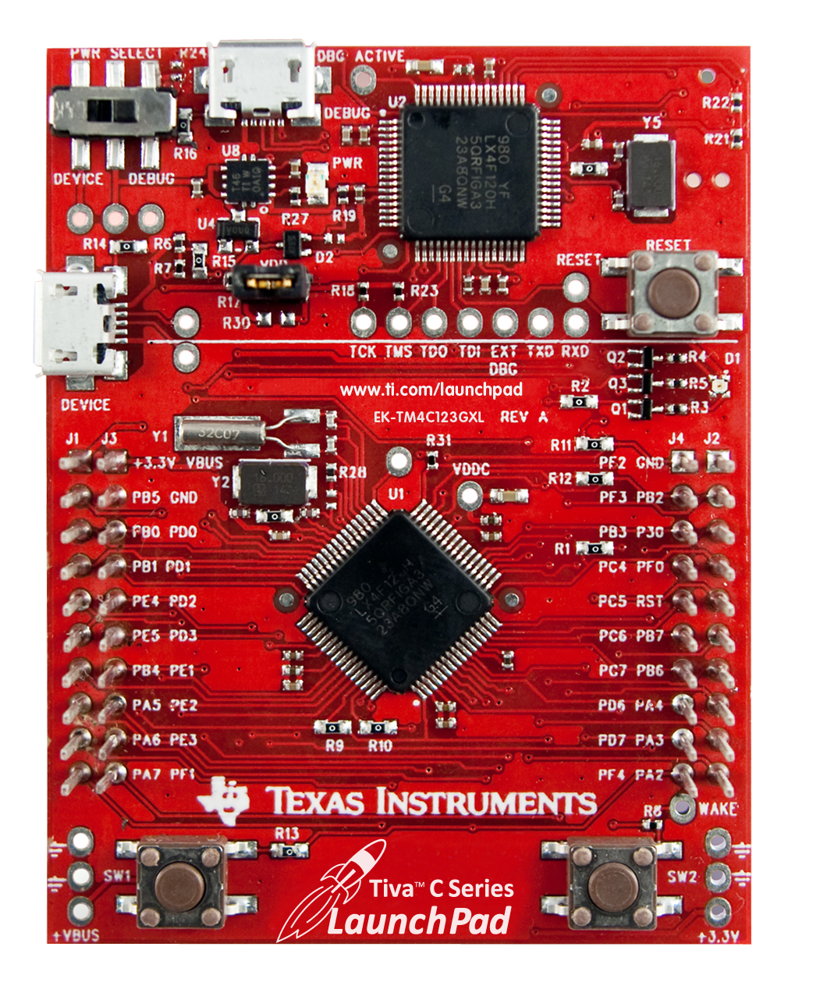

.. _tm4c123gxl_launchxl:

TM4C123GXL LaunchXL
###################

Overview
********
The TM4C123G LaunchPad Evaluation Kit is a low-cost evaluation platform for ARM 
Cortex-M4F based microcontrollers from Texas Instruments. The design of the 
TM4C123G LaunchPad highlights the TM4C123GH6PM microcontroller with a USB 2.0 
device interface and hibernation module.

See the `TI TM4C123GXL Product Page`_ for details.

Features:
=========

* High Performance TM4C123GH6PM MCU:

    + 80MHz 32-bit ARM Cortex-M4-based microcontrollers CPU
    + 256KB Flash, 32KB SRAM, 2KB EEPROM
    + Two Controller Area Network (CAN) modules
    + USB 2.0 Host/Device/OTG + PHY
    + Dual 12-bit 2MSPS ADCs, motion control PWMs
    + 8 UART, 6 I2C, 4 SPI
    
* On-board In-Circuit Debug Interface (ICDI)
* USB Micro-B plug to USB-A plug cable
* Preloaded RGB quick-start application

Details on the TM4C123G LaunchPad development board can be found in the
`TM4C123G LaunchPad User's Guide`_.

Supported Features
==================

Zephyr has been ported to the Applications MCU, with basic peripheral
driver support.

+-----------+------------+-----------------------+
| Interface | Controller | Driver/Component      |
+===========+============+=======================+
| UART      | on-chip    | serial port-interrupt |
+-----------+------------+-----------------------+
| GPIO      | on-chip    | gpio                  |
+-----------+------------+-----------------------+
| LED_RGB   | on-chip    | gpio                  |
+-----------+------------+-----------------------+
| SW        | on-chip    | gpio                  |
+-----------+------------+-----------------------+

Connections and IOs
====================

Peripherals on the TM4C123G LaunchPad are mapped to the following pins in
the file :file:`boards/arm/ti_tm4c123gxl_lauchpad/pinmux.c`.

+------------+-----+------+
| Function   | PIN | GPIO |
+============+=====+======+
| UART0_TX   | 17  | PA0  |
+------------+-----+------+
| UART0_RX   | 18  | PA1  |
+------------+-----+------+
| LED D7 (R) | 64  | PF1  |
+------------+-----+------+
| LED D6 (B) | 01  | PF2  |
+------------+-----+------+
| LED D5 (G) | 02  | PF3  |
+------------+-----+------+
| Switch SW1 | 15  | PF4  |
+------------+-----+------+
| Switch SW2 | 04  | PF0  |
+------------+-----+------+

The default configuration can be found in the Kconfig file at
:file:`boards/arm/ti_tm4c123gxl_lauchpad/tm4c123gxl_launchxl_defconfig`.

Programming and Debugging
*************************

TI officially supports development on the CC3220SF using the TI
`CC3220 SDK`_ on Windows and Linux using TI tools: Code Composer
Studio for debugging and `UniFlash`_ for flashing.

For Windows developers, see the `CC3220 Getting Started Guide`_ for
instructions on installation of tools, and how to flash the board using
UniFlash.

Note that zephyr.bin produced by the Zephyr SDK may not load via
UniFlash tool.  If encountering difficulties, use the zephyr.elf
file and dslite.sh instead.

The following instructions are geared towards Linux developers who
prefer command line tools to an IDE.

Flashing
========

The TI UniFlash tool can be used to download a program into flash, which
will persist over subsequent reboots.

Prerequisites:
--------------

#. Python 2.7 (the DSLite tool does not work with Python v 3.x).
#. Download and install `UniFlash`_ version 4.1 for Linux.
#. Jumper SOP[2..0] (J15) to 010, and connect the USB cable to the PC.

   This should result in a new device "Texas Instruments XDS110 Embed
   with CMSIS-DAP" appearing at /dev/ttyACM1 and /dev/ttyACM0.

#. Update the service pack, and place board in "Development Mode".

   Follow the instructions in Section 3.4 "Download the Application",
   in the `CC3220 Getting Started Guide`_, except for steps 5 and 6 which
   select an MCU image.

#. Ensure the XDS-110 emulation firmware is updated.

   Download and install the latest `XDS-110 emulation package`_.
   Follow the directions here to update the firmware:
   http://processors.wiki.ti.com/index.php/XDS110#Updating_the_XDS110_Firmware

#. Ensure CONFIG_XIP=y is set.

   Add a 'CONFIG_XIP=y' line to the project's prj.conf file.

   This locates the program into flash, and sets CONFIG_CC3220SF_DEBUG=y,
   which prepends a debug header enabling the flash to persist over
   subsequent reboots, bypassing the bootloader flash signature
   verification.

   See Section of the 21.10 of the `CC3220 TRM`_ for details on the
   secure flash boot process.

Flashing Command:
-----------------

Once the above prerequisites are met, use the UniFlash command line tool
to flash the Zephyr image:

.. code-block:: console

  % dslite.sh -c $ZEPHYR_BASE/boards/arm/cc3220sf_launchxl/support/CC3220SF.ccxml \
    -e -f zephyr.elf

The CC3220SF.ccxml is a configuration file written by TI's Code Composer
Studio IDE, and required for the dslite.sh tool.

To see program output from UART0, one can execute in a separate terminal
window:

.. code-block:: console

  % screen /dev/ttyACM0 115200 8N1

Debugging
=========

It is possible to enable loading and debugging of an application via
openocd and gdb, by linking and locating the program completely in SRAM.

Prerequisites:
--------------

Follow the same prerequisites as in Flashing above, in addition:

#. Ensure OpenOCD v0.9+ is configured/built with CMSIS-DAP support.
#. Power off the board, jumper SOP[2..0] (J15) to 001, and reconnect
   the USB cable to the PC.
#. Set CONFIG_XIP=n and build the Zephyr elf file.

The necessary OpenOCD CFG and sample gdbinit scripts can be found in
:file:`boards/arm/cc3220sf_launchxl/support/`.

Debugging Command
-----------------

.. code-block:: console

  % arm-none-eabi-gdb -x $ZEPHYR_BASE/boards/arm/cc3220sf_launchxl/support/gdbinit_xds110 \
    zephyr.elf

References
**********

CC32xx Wiki:
    http://processors.wiki.ti.com/index.php/CC31xx_%26_CC32xx

.. _TI TM4C123GXL Product Page:
    http://www.ti.com/tool/ek-tm4c123gxl

.. _CC3220 TRM:
   http://www.ti.com/lit/ug/swru465/swru465.pdf

.. _CC3220 Programmer's Guide:
   http://www.ti.com/lit/ug/swru464/swru464.pdf

.. _CC3220 Getting Started Guide:
   http://www.ti.com/lit/ug/swru461/swru461.pdf

.. _UniFlash:
   http://processors.wiki.ti.com/index.php/Category:CCS_UniFlash

.. _CC3220 SDK:
   http://www.ti.com/tool/download/SIMPLELINK-CC3220-SDK

.. _TM4C123G LaunchPad User's Guide:
   http://www.ti.com/lit/ug/spmu296/spmu296.pdf

..  _XDS-110 emulation package:
   http://processors.wiki.ti.com/index.php/XDS_Emulation_Software_Package#XDS110_Reset_Download
